# 개요

Lecture 3) Semantic Segmentation의 기초와 이해 & FCN

1. 세그멘테이션 개요

   1.1 Semantic Segmentation과 다른 분야 비교

   1.2 Segmentation 활용 분야

2. 대표적인 딥러닝을 이용한 세그멘테이션 FCN

   2.1 Abstract

   2.2 Fully Connected Layer vs Convolution Layer

   2.3 Transposed Convolution

   2.4 FCN에서 성능을 향상시키기 위한 방법

3. 결론

   3.1 결과

   3.2 정리

# 1. 세그멘테이션 개요
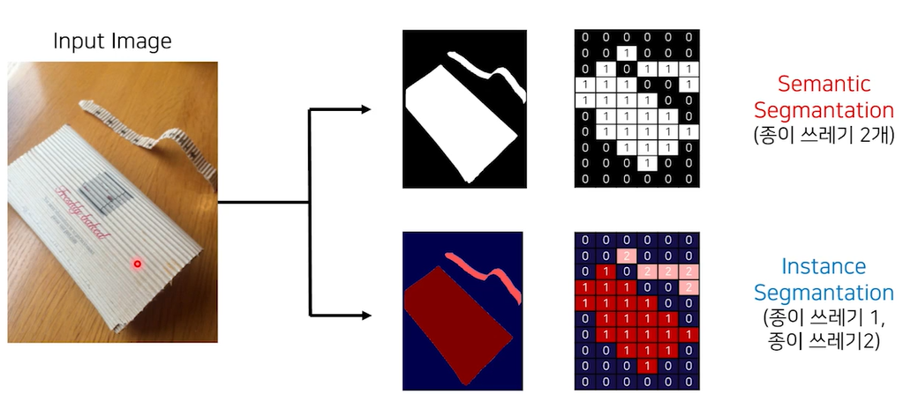

## 1.1 Semantic Segmentation과 다른 분야 비교

- Object Detection은 Multi object를 위한 Image Localization
- Image Segmantation은 pixel 단위 class 분류

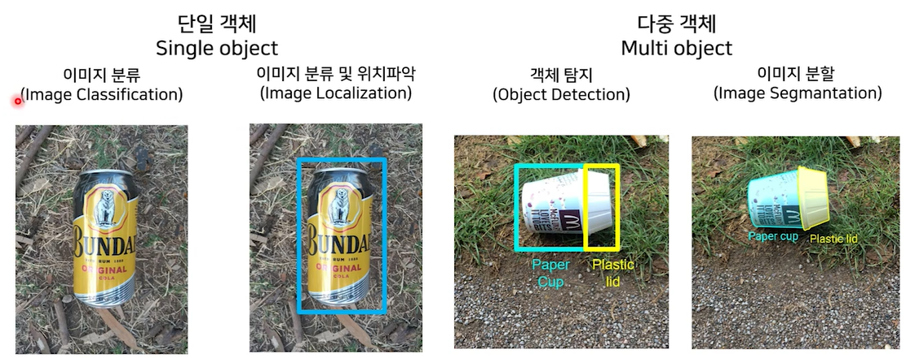

## 1.2 Segmentation 활용 분야
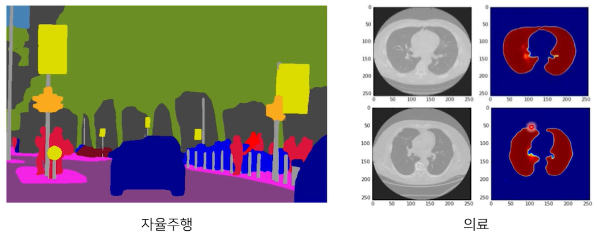

# 2. 대표적인 딥러닝을 이용한 세그멘테이션 FCN

세그멘테이션을 처음 가능하게 했던 FCN 논문(Fully Convolutional Networks for Semantic Segmentaiton, 2015)

1. VGG 네트워크 백본을 사용
2. VGG 네트워크의 FC Layer (nn.Linear)를 Convolution으로 대체
3. Transposed Convolution을 이용해서 Pixel Wise prediction 수행

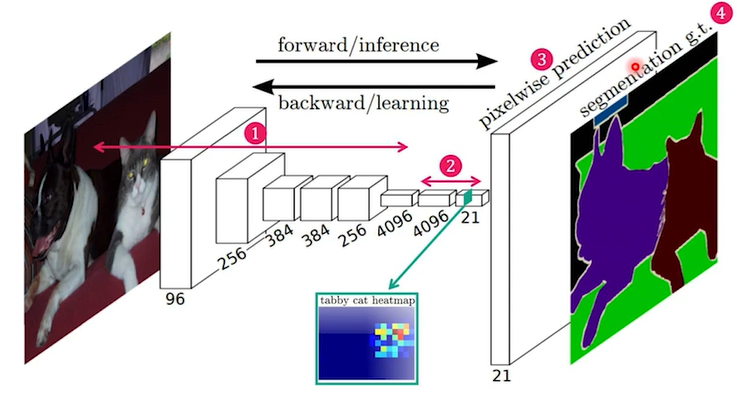

## 2.1 VGG

VGG: 3x3 Convolution layer를 deep하게 쌓아 적은 파라미터 숫자로 효과적인 receptive field 유지

Backbone: 더 좋은 환경에서 훈련된 모델을 사용 => 시간 절약 및 성능 향상

## 2.2 Fully Connected Layer vs Convolution Layer

### 특징1. Pixel의 위치정보를 유지한다.

- Classifier: transition invarience => 입력의 위치 변화에도 동일한 출력 효과

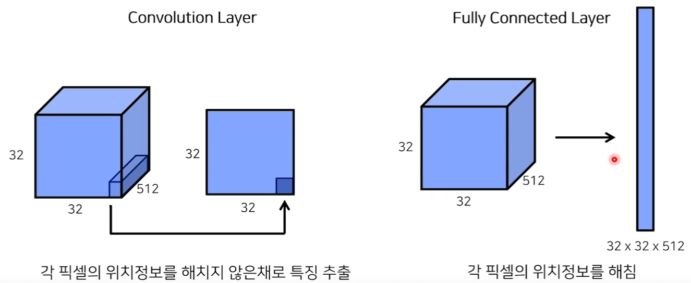

### 특징2. 임의의 입력 크기값에도 동일한 크기의 출력

- 1x1 Convolution => Convolution은 kernel의 파라미터에 의해 영향을 받고, 이미지 혹은 레이어의 크기와는 무관

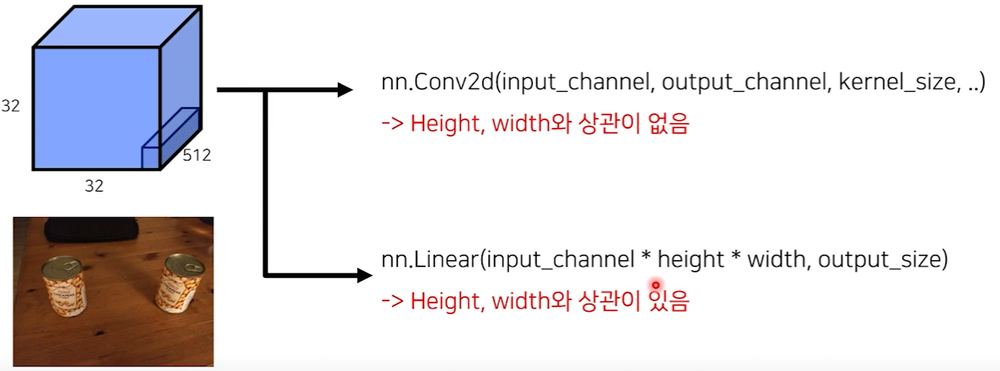

## 2.3 Transposed Convolution

Segmantaion은 Upsampling 필요 => Transposed Convolution 방법 활용

### Downsampling

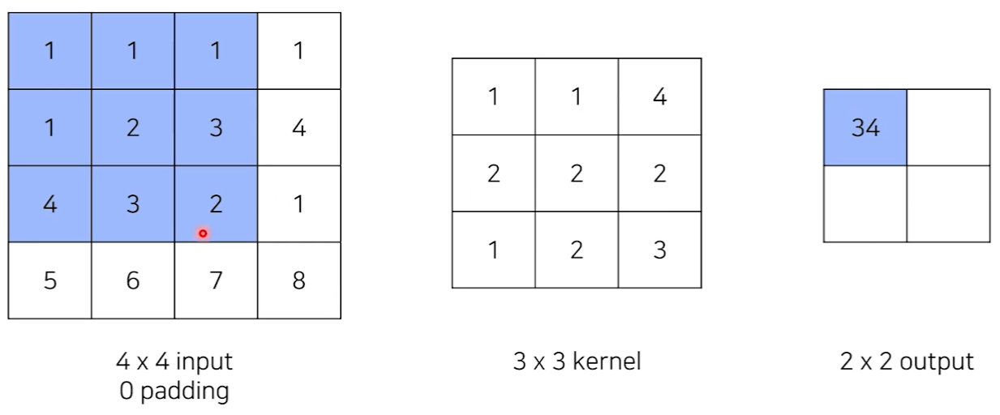

### Upsampling

> == Deconvolution == Transposed Convolution

- stride 변화를 통해 출력 사이즈 조절이 가능하다.
  - e.g. stride:1 => 4x4, stride:2 => 5x5

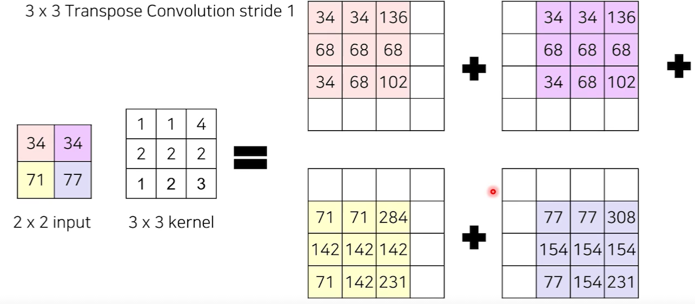

### Downsampling

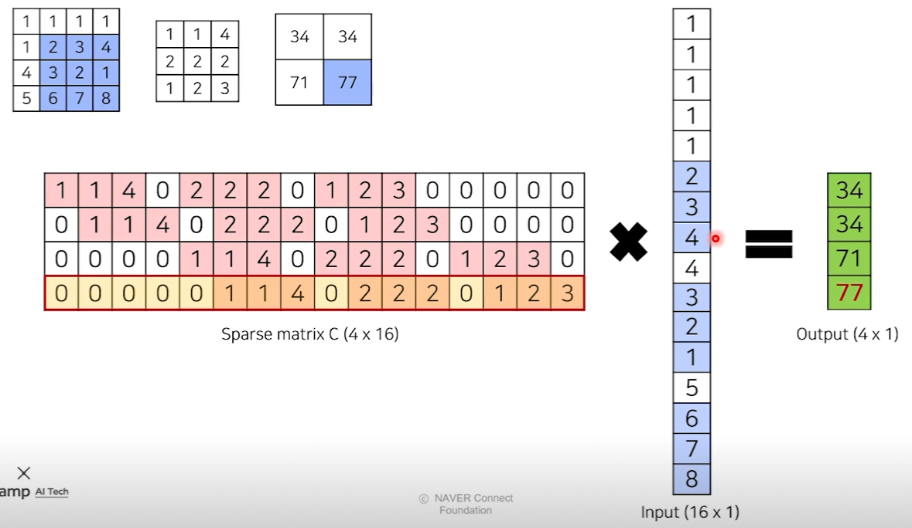

### Transposed Convolution

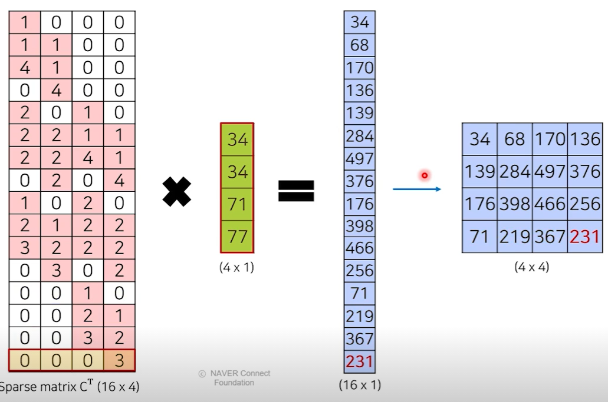

### Deconvolution

엄밀히 결과가 동일하지 않기에 수학적으론 틀린 표현이나, 관용적으로 동일한 의미로 쓰인다.

### Transposed Convolution 정리

- Convolution과 동일하게 `학습 가능한 파라미터`를 통해서 줄어든 이미지를 다시 키우는 Convolution
- Deconvolution으로 부르나 실제론 Convolution

## 2.4 FCN에서 성능을 향상시키기 위한 방법

- 편의상 FC6을 7x7이 아닌 1x1 Conv로 대체
  - 7x7을 사용할땐 어떤 효과가 있을지는 추후 자료를 통해
- Dropout: robust한 모델
- Deconv: 줄어든 이미지 사이즈 복원
  - 32배(FCN-32s): kernel_size=64, stride=32, padding=16
  - 32배 줄어든 이미지를 32배 늘리는 작업으로 경계에 대한 정보가 사라지는 것을 볼 수 있다.
  - 극복 => 1. `Stride`를 줄이고, `Skip-connection` 사용

정리

1. Maxpooling에 의해서 잃어버린 정보를 복원해주는 작업 진행 (by skip-connection)

   - conv5의 Pooling의 값만 사용 => FCN-16s

   - conv3의 Pooling의 값도 추가로 사용 => FCN-8s

2. Upsampled Size를 줄여주기에 좀 더 효율적인 이미지 복원 가능 (2개의 Decov layer 적층)

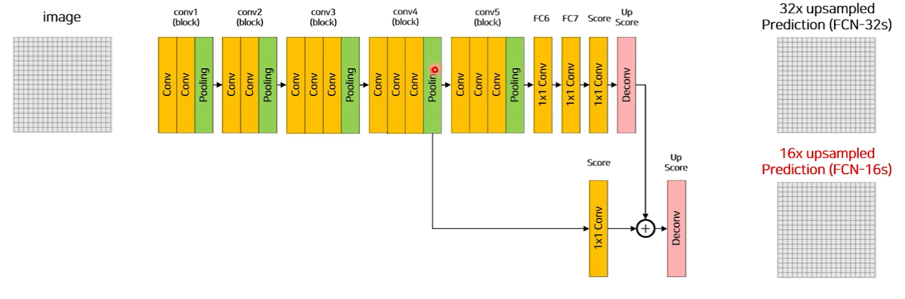

# 3. 결론

## 3.1 결과

### 3.1.1 평가지표

- Pixel Accuracy
- Mean IoU
  - Segmenation에서 가장 많이 사용하는 평가 지표 & 본 컴패티션에서 사용하는 평가지표

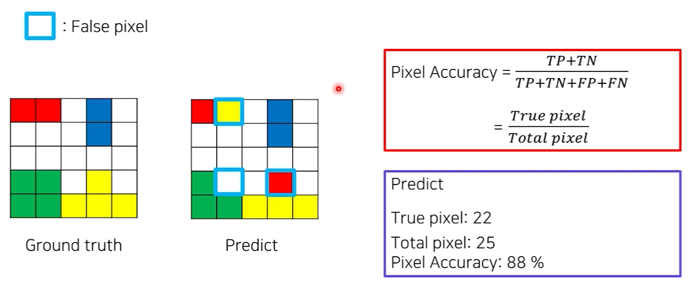

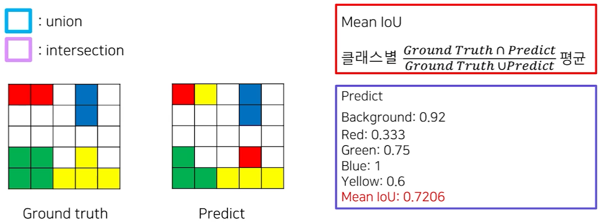

## 3.2 정리

### 3.2.1 FCN 논문

1. VGG Backbone: 효율적인 weight 사용
2. Fully connected layer => Convolution layer: 위치정보를 해치지 않음
3. Fully connected layer => Convolution layer: 임의의 입력값에도 동일 크기 출력 (by 1x1 Conv) 

### 3.2.2 Transposed Convolution

 학습 가능한 파라미터를 이용해 Upsampling

### 3.2.3 FCN-32s => FCN-16s => FCN-8s

1. Maxpooling에 의해서 잃어버린 정보를 복원해주는 작업 진행 (by `skip-connection`)

   - conv5의 Pooling의 값만 사용 => FCN-16s

   - conv3의 Pooling의 값도 추가로 사용 => FCN-8s

2. `Upsampled Size`를 줄여주기에 좀 더 효율적인 이미지 복원 가능 (2개의 Decov layer 적층)

### 3.2.4 평가지표

- Pixel Accuracy
- Mean IoU: 클래스별 Iou, Segmentation에서 가장 많이 사용되는 평가지표

### 3.2.5 다음강의에선

- FCN에서 살펴본 모델의 한계점
- 극복
  - by encoder & decoder
  - by skip-connection
  - by receptive-field 향상

# 4. Further Reading

## 4.1 7x7 Conv 사용시 문제

- 해당 레이어를 지나며 `이미지의 크기`가 변화
- (논문) => `conv1의 첫번째 conv`에 `100 zero pedding` 부여 => `Output size` 달라지는 문제

## 4.2 해결방법

- 똑같이 패딩을 주고 마지막에 Crop